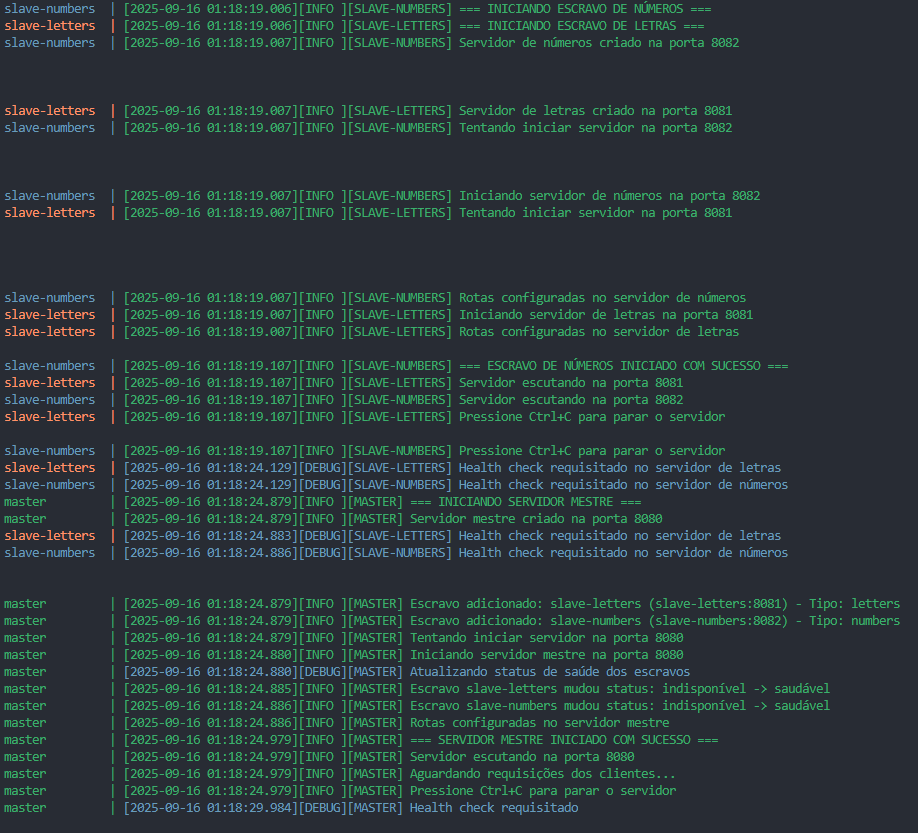
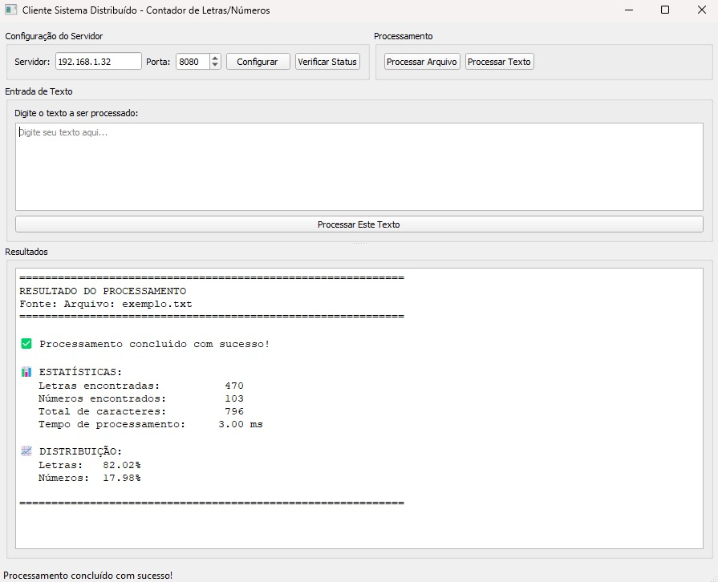

# 🚀 Sistema Distribuído - Contador de Letras e Números

[](https://python.org)
[](https://pypi.org/project/PyQt5/)
[](https://docker.com)
[](LICENSE)

Sistema distribuído moderno para análise de texto que conta letras e números utilizando arquitetura **mestre-escravo** com múltiplos serviços especializados.

## 📑 Índice

- [Visão Geral](#-visão-geral)
- [Arquitetura](#-arquitetura)
- [Funcionalidades](#-funcionalidades)
- [Pré-requisitos](#-pré-requisitos)
- [Instalação e Execução](#-instalação-e-execução)
- [Uso em Rede](#-uso-em-rede)
- [Exemplos de Uso](#-exemplos-de-uso)
- [API Reference](#-api-reference)
- [Solução de Problemas](#-solução-de-problemas)
- [Contribuição](#-contribuição)

## 🎯 Visão Geral

Este projeto implementa um sistema distribuído que processa texto de forma eficiente, dividindo a tarefa de contagem entre serviços especializados:

- **🎛️ Mestre**: Coordena requisições e agrega resultados
- **🔤 Escravo de Letras**: Conta exclusivamente letras do alfabeto
- **🔢 Escravo de Números**: Conta exclusivamente dígitos numéricos
- **🖥️ Cliente**: Interface gráfica para interação com o usuário

### 🌐 Arquitetura de Rede

```
Máquina A (Servidor)          Máquina B (Cliente)
┌─────────────────────┐       ┌─────────────────────┐
│  🐳 Docker Compose  │  ⟷  │  🖥️ Cliente PyQt5   │
│   🎛️ Master (8080)  │      │                      │
│   📝 Slave-Letters  │      │  Enviará arquivos    │
│   🔢 Slave-Numbers  │      │  via HTTP REST       │
└─────────────────────┘       └─────────────────────┘
      IP: 192.168.1.100             IP: 192.168.1.101
```

## 🏗️ Arquitetura

### Componentes do Sistema

```mermaid
graph TB
    Client[Cliente PyQt5] --> Master[Servidor Mestre :8080]
    Master --> SlaveL[Escravo Letras :8081]
    Master --> SlaveN[Escravo Números :8082]

    Master --> |Agrega Resultados| Client
    SlaveL --> |Contagem Letras| Master
    SlaveN --> |Contagem Números| Master
```



### Tecnologias Utilizadas

| Componente          | Tecnologia         | Linguagem | Porta |
| ------------------- | ------------------ | --------- | ----- |
| **Servidor Mestre** | Go + Gin Framework | Go        | 8080  |
| **Escravo Letras**  | C++ + httplib      | C++       | 8081  |
| **Escravo Números** | C++ + httplib      | C++       | 8082  |
| **Cliente**         | PyQt5 + requests   | Python    | -     |
| **Orquestração**    | Docker Compose     | YAML      | -     |

## ⚡ Funcionalidades

### 🖥️ Interface do Servidor


_Tela do servidor mostrando logs e status dos serviços_

### 🖱️ Interface do Cliente


_Interface gráfica do cliente com processamento de texto_

### Recursos Principais

- ✅ **Processamento Distribuído**: Divisão inteligente de tarefas
- ✅ **Interface Gráfica**: Cliente PyQt5 moderno e intuitivo
- ✅ **Processamento Assíncrono**: Não bloqueia a interface durante operações
- ✅ **Suporte a Arquivos**: Processa arquivos de texto de qualquer tamanho
- ✅ **Entrada Manual**: Digite texto diretamente na interface
- ✅ **Estatísticas Detalhadas**: Contagens e percentuais precisos
- ✅ **Tempo de Resposta**: Métricas de performance em tempo real
- ✅ **Health Check**: Monitoramento automático dos serviços
- ✅ **Logs Estruturados**: Sistema de logging completo
- ✅ **Tolerância a Falhas**: Recuperação automática de erros

## ⚙️ Pré-requisitos

### Para o Servidor (Docker)

- **Docker Engine** 20.10+
- **Docker Compose** 2.0+
- **Porta 8080, 8081, 8082** disponíveis

### Para o Cliente

- **Python** 3.7+
- **pip** para instalação de dependências

### Verificação dos Pré-requisitos

```bash
# Verificar Docker
docker --version
docker-compose --version

# Verificar Python
python --version
pip --version

# Verificar portas disponíveis (Windows)
netstat -an | findstr "8080\|8081\|8082"
```

## 🚀 Instalação e Execução

### 1️⃣ Clonar o Repositório

```bash
git clone https://github.com/seu-usuario/mestre-escravo-sistemas-distribuidos.git
cd mestre-escravo-sistemas-distribuidos
```

### 2️⃣ Executar o Servidor (Docker)

```bash
# Construir e iniciar todos os serviços
docker-compose up --build -d

# Verificar se todos os serviços estão rodando
docker-compose ps

# Visualizar logs (opcional)
docker-compose logs -f
```

### 3️⃣ Executar o Cliente

```bash
# Navegar para o diretório do cliente
cd client

# Instalar dependências
pip install -r requirements.txt

# Executar cliente
python client.py

# Ou especificar servidor remoto
python client.py 192.168.1.100 8080
```

### 4️⃣ Verificar Funcionamento

```bash
# Testar servidor diretamente
curl http://localhost:8080/health

# Resposta esperada:
# {"status": "healthy", "timestamp": "2024-01-01T12:00:00Z"}
```

## 🌐 Uso em Rede

### Configuração para Múltiplas Máquinas

#### 🖥️ Máquina Servidor (com Docker)

1. **Descobrir IP da máquina:**

   ```bash
   # Windows
   ipconfig

   # Linux/Mac
   ip addr show
   ```

2. **Anotar o IP** (exemplo: `192.168.1.100`)

3. **Configurar firewall** (se necessário):

   ```bash
   # Windows (executar como Admin)
   netsh advfirewall firewall add rule name="Docker Ports" dir=in action=allow protocol=TCP localport=8080-8082

   # Linux
   sudo ufw allow 8080:8082/tcp
   ```

#### 💻 Máquina Cliente

1. **Copiar pasta client** para a máquina cliente

2. **Instalar dependências:**

   ```bash
   pip install -r requirements.txt
   ```

3. **Executar cliente apontando para servidor:**

   ```bash
   # Método 1: Via linha de comando
   python client.py 192.168.1.100 8080

   # Método 2: Via interface gráfica
   python client.py
   # Depois configurar IP: 192.168.1.100, Porta: 8080
   ```

### 🔗 Teste de Conectividade

```bash
# Na máquina cliente, testar conectividade
ping 192.168.1.100

# Testar serviço
curl http://192.168.1.100:8080/health
```

## 📋 Exemplos de Uso

### Exemplo 1: Processamento de Texto Simples

**Entrada:**

```
Olá mundo! Tenho 25 anos e 3 gatos.
```

**Resultado:**

```
============================================================
                 RESULTADO DO PROCESSAMENTO
 Fonte: Texto (34 caracteres)
============================================================
✅ Processamento concluído com sucesso!

📊 ESTATÍSTICAS:
   Letras encontradas:     24
   Números encontrados:     2
   Total de caracteres:    34
   Tempo de processamento: 45.67 ms

📈 DISTRIBUIÇÃO:
   Letras:  92.31%
   Números:  7.69%
============================================================
```

### Exemplo 2: Processamento de Arquivo

**Arquivo: exemplo.txt**

```
Sistema Distribuído - Versão 2.0
Processando 1000 caracteres em 3 serviços.
Performance: 99.9% de uptime.
```

**Comando:**

```bash
# Selecionar arquivo via interface gráfica
# Ou usar botão "Processar Arquivo"
```

## 🔌 API Reference

### Endpoints Disponíveis

#### `GET /health`

Verificar status do servidor

**Resposta:**

```json
{
  "status": "healthy",
  "timestamp": "2024-01-01T12:00:00Z",
  "slaves": {
    "letters": "healthy",
    "numbers": "healthy"
  }
}
```

#### `POST /process`

Processar texto

**Request:**

```json
{
  "text": "Exemplo de texto com 123 números"
}
```

**Response:**

```json
{
  "success": true,
  "letters_count": 25,
  "numbers_count": 3,
  "total_characters": 35,
  "processing_time_ms": 42.5
}
```

## 🔧 Solução de Problemas

### Problemas Comuns

#### ❌ "Conexão recusada"

```bash
# Verificar se Docker está rodando
docker ps

# Verificar portas
netstat -an | grep 8080

# Verificar logs
docker-compose logs master
```

#### ❌ "Timeout na conexão"

- ✅ Verificar firewall em ambas as máquinas
- ✅ Confirmar se estão na mesma rede
- ✅ Testar ping entre máquinas

#### ❌ "Cliente não encontra PyQt5"

```bash
# Instalar PyQt5
pip install PyQt5

# Ou reinstalar dependências
pip install -r requirements.txt --force-reinstall
```

## 🤝 Contribuição

### Estrutura do Projeto

```
mestre-escravo-sistemas-distribuidos/
├── 📁 master/              # Servidor mestre (C++)
│   ├── src/
│   ├── CMakeLists.txt
│   └── Dockerfile
├── 📁 slave_letters/       # Escravo de letras (C++)
│   ├── src/
│   ├── CMakeLists.txt
│   └── Dockerfile
├── 📁 slave_numbers/       # Escravo de números (C++)
│   ├── src/
│   ├── CMakeLists.txt
│   └── Dockerfile
├── 📁 client/              # Cliente (Python)
│   ├── client.py
│   └── requirements.txt
├── 📁 docs/                # Documentação e imagens
│   └── images/
├── docker-compose.yml      # Orquestração dos serviços
└── README.md
```

## 📄 Licença

Este projeto está licenciado sob a **MIT License**.

---

**Desenvolvido com ❤️ para sistemas distribuídos modernos**
